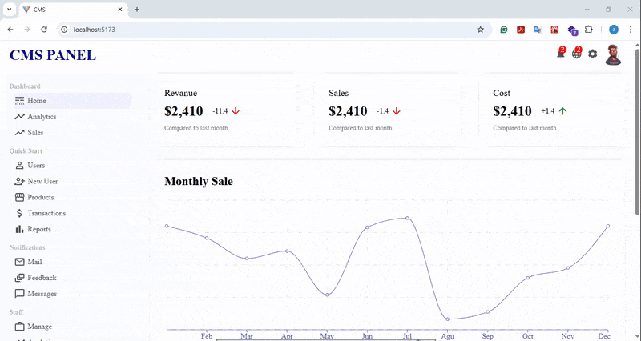

<div dir='rtl' align='right'>

#App Demo



#cms panel App
یک اپلیکیشن سفارش غذا از رستوران که کاربران میتوانند از بین منوی هایی که با کلیک رو دسته بندی آنها، غذای هر دسته بندی را نمایش میدهد انتخاب و به سبد خرید اضافه و ثبت سفارش نمایند.
این اپ با react و به صورت SPA ساخته شده است.

#ویژگی ها
-نمایش آماری به صورت چارت
-نمایش آخرین تراکنش ها
-نمایش موجودی محصولات
نمایش لیست کاربران
-طراحی به صورت SPA
-استفاده از "React-router-dom" برای مدیریت مسیرها
-استفاده از "MUI" برای ایکون های کاربردی

#پیش نیازها
-node.js
-npm

#نصب(installation)

Bash:
git clone
[https://](https://github.com/AmirNouri-dev/CMS-Project-reactjs)
npm install
npm run dev

#ساختار پروژه

<div dir='ltr'>
  
```plaintext

|-CMSProject/
|--src
|---components #reusable components
|----Chart
|----Features
|----widgetSm
|----widgetLm
|----topBar
|----sideBar
|---contexts
|---pages #main pages(home,login,sigin,etc.)
|----home
|----login
|----newUser
|----userList
|----product
|----products
|---assets #include demo
|--public
|--- images #all images used in App
|--app.js #نقطه ورود اپ و تنظیم مسیرها
|-- README.md

```


</div>

</div>
```
